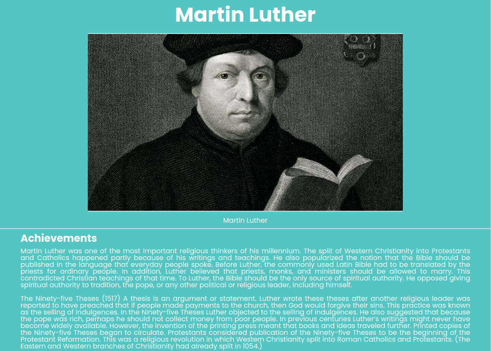

<!-- Headings -->

### FreeCodeCamp Responsive Projects

# Tribute Page

_User Story #1_: My tribute page should have an element with a corresponding id="main", which contains all other elements.

_User Story #2_: I should see an element with a corresponding id="title", which contains a string (i.e. text) that describes the subject of the tribute page (e.g. "Dr. Norman Borlaug").

_User Story #3_: I should see a div element with a corresponding id="img-div".

_User Story #4_: Within the img-div element, I should see an img element with a corresponding id="image".

_User Story #5_: Within the img-div element, I should see an element with a corresponding id="img-caption" that contains textual content describing the image shown in img-div.

_User Story #6_: I should see an element with a corresponding id="tribute-info", which contains textual content describing the subject of the tribute page.

_User Story #7_: I should see an a element with a corresponding id="tribute-link", which links to an outside site that contains additional information about the subject of the tribute page. HINT: You must give your element an attribute of target and set it to \_blank in order for your link to open in a new tab (i.e. target="\_blank").

_User Story #8_: The img element should responsively resize, relative to the width of its parent element, without exceeding its original size.

_User Story #9_: The img element should be centered within its parent element.

---

> View Project:

[Codepen](https://codepen.io/sanjeevgaha/full/bGVWgga "Tribute Page")

> Screenshot

